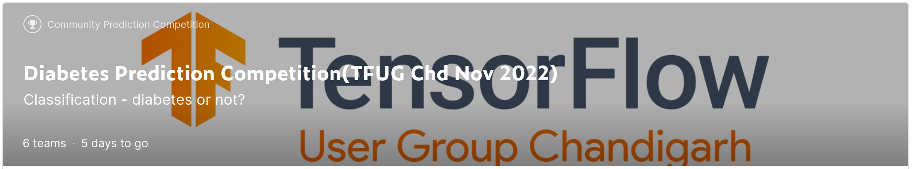

# Diabetes Prediction Competition(TFUG Chd Nov 2022)
There are 17 feature variables and 1 target variable - "Diabetes". This is a binary classification problem where 0 means no diabetes and 1 means diabetes. The task is to predict the probability of the person having diabetes provided the given data.
 

#### Methods :point_down:
The implemented solution can be summarized in the following core steps:
* Pre-processing
* LGBMRegressor
* KFold as a bagging approach
* Ensemble learning
